# 系統流程圖

> 涵蓋 LINE OA 預約系統 MVP（v0.1.0）的所有主要流程。圖用 Mermaid 語法（GitHub、VSCode、Obsidian 等預覽器原生支援）。

---

## 0. 系統架構（誰跟誰講話）

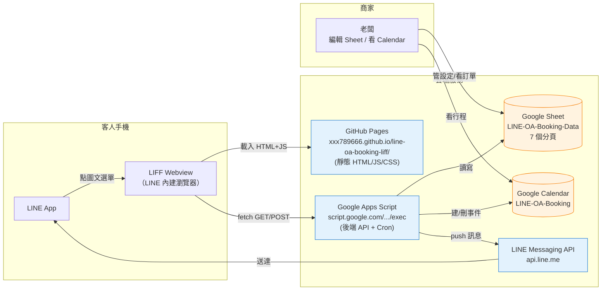

---

## 1. 客人預約完整流程（成功路徑）

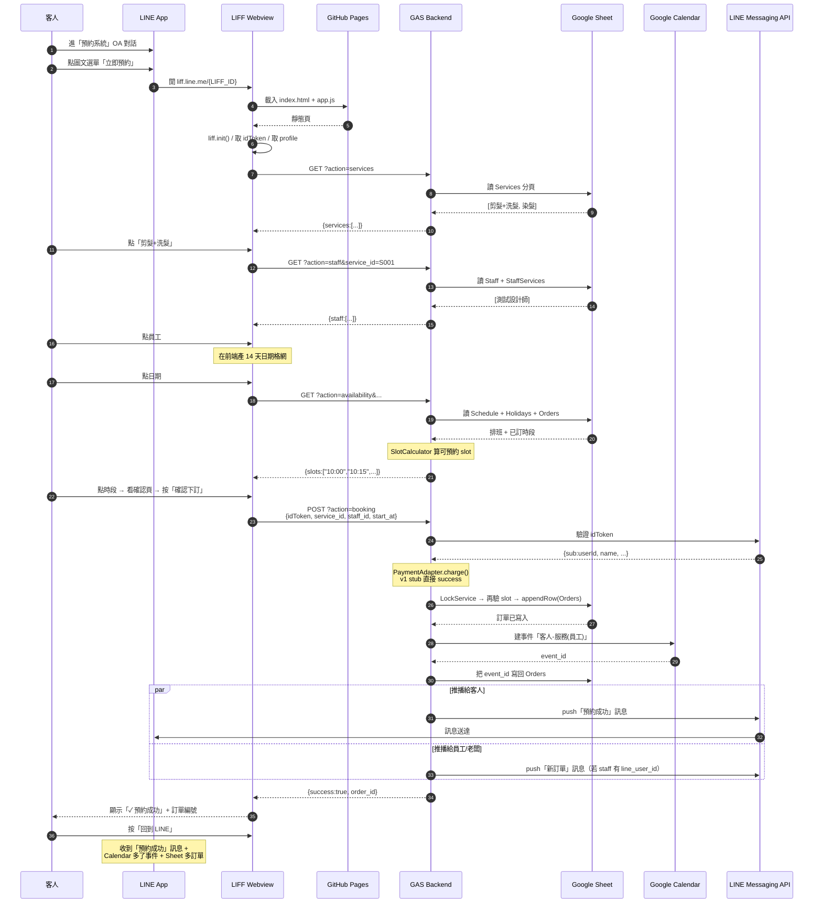

---

## 2. 客人預約流程的決策樹

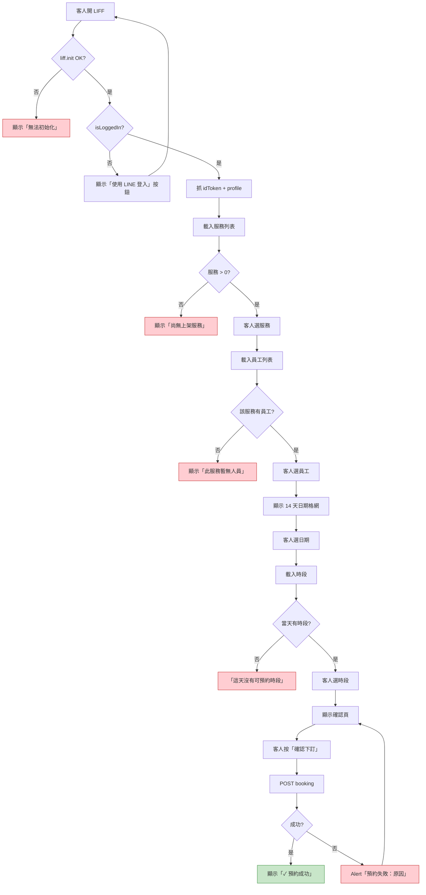

---

## 3. 後端 booking handler 內部處理

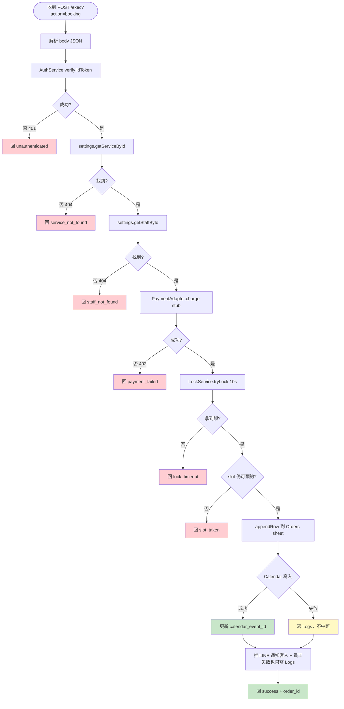

---

## 4. 24 小時前提醒 cron（背景排程）

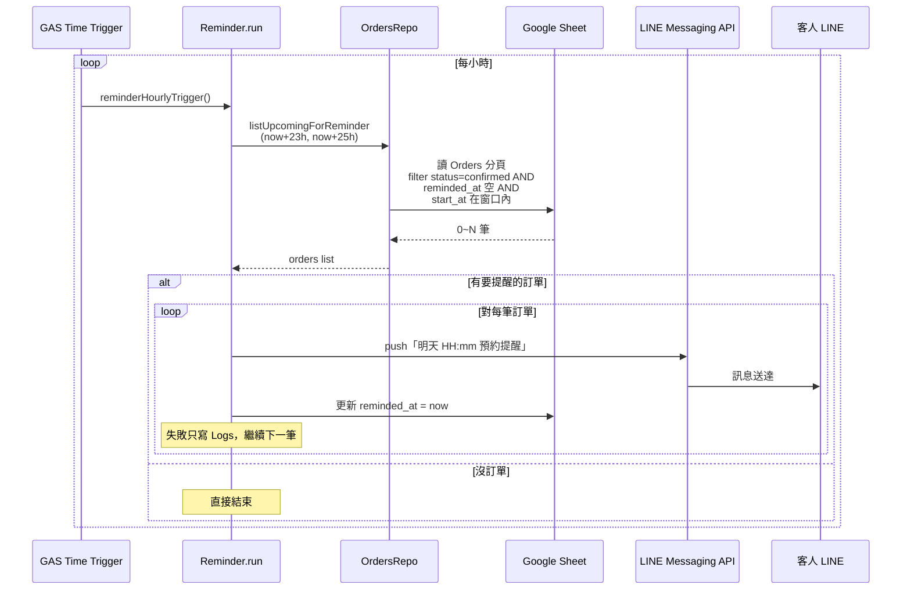

---

## 5. 取消預約流程（v1 後端已實作，前端 UI 未做）

```mermaid
flowchart TD
  A[客人 LIFF 進「我的預約」<br/>v2 才會做] --> B[點某筆訂單的「取消」]
  B --> C[POST /exec?action=cancel<br/>{idToken, order_id}]
  C --> D[AuthService.verify idToken]
  D --> E{找到 order?}
  E -->|否| R1[回 order_not_found]
  E -->|是| F{訂單擁有者<br/>= 當前客人?}
  F -->|否| R2[回 not_owner]
  F -->|是| G{status = confirmed?}
  G -->|否| R3[回 already_cancelled]
  G -->|是| H{start_at - now > 24h?}
  H -->|否| R4[回 too_late]
  H -->|是| I[Orders.cancel<br/>status = cancelled]
  I --> J[CalendarSync.deleteEvent]
  J --> K[PaymentAdapter.refund stub]
  K --> L[推 LINE 通知員工取消]
  L --> M[回 success]

  classDef ok fill:#c8e6c9
  classDef err fill:#ffcdd2
  class M ok
  class R1,R2,R3,R4 err
```

---

## 6. SlotCalculator 演算法

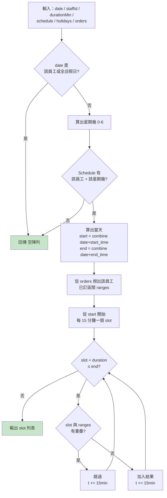

---

## 7. 資料流（一個訂單從成立到完成）

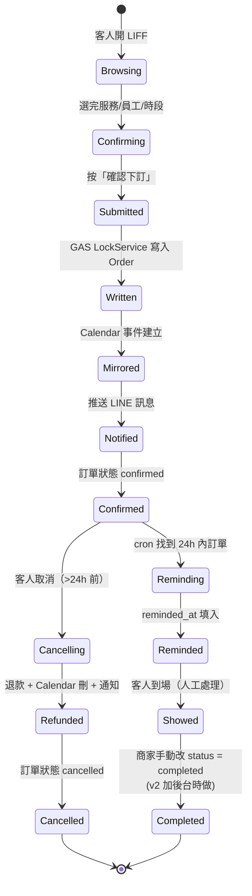

---

## 8. 容錯處理（失敗時系統怎麼反應）

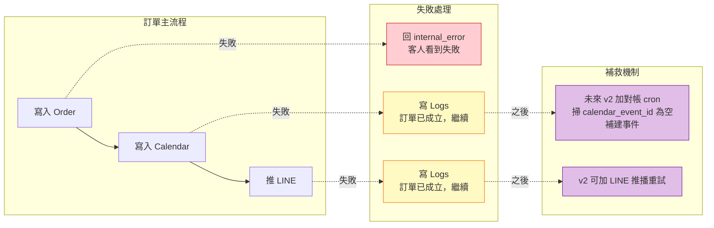

---

## 9. 部署 / 程式碼變動的流程（給未來改 code 的自己看）

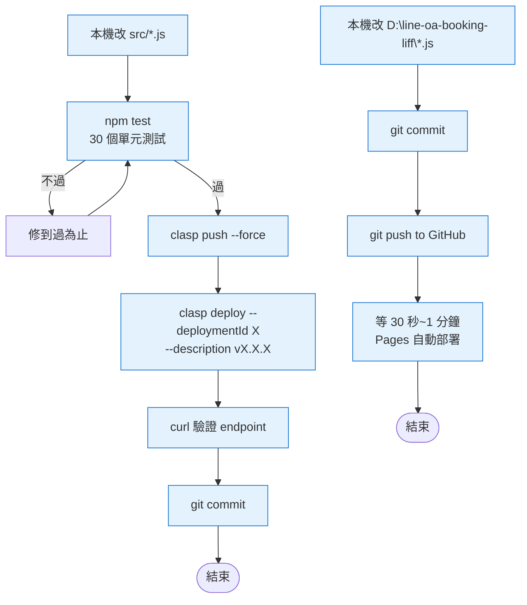

---

## 10. 商家後台的「使用者」流程（純 Google Workspace）

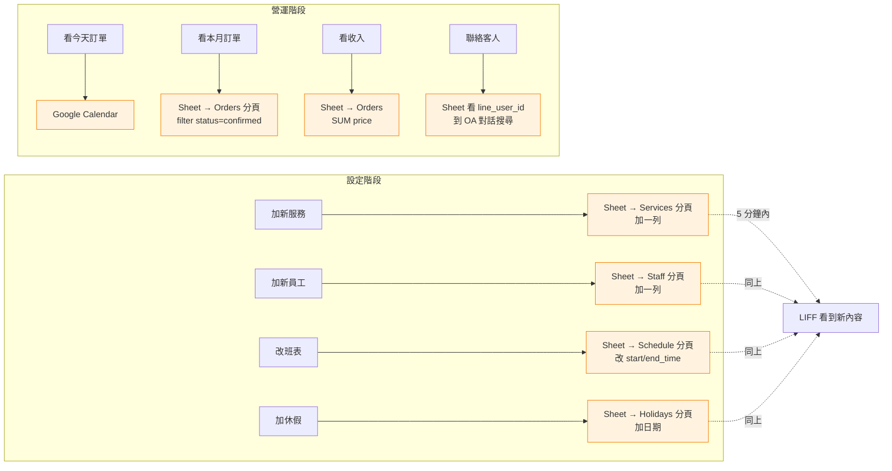

> **重點**：商家完全不需要學任何後台介面，只用 Google Sheet + Google Calendar 就能管整個業務。Cache TTL = 5 分鐘，所以改 Sheet 後客人那邊最多 5 分鐘看到變更。

---

## 11. 帳號／服務地圖（這套系統用了哪些 Google + LINE 服務）

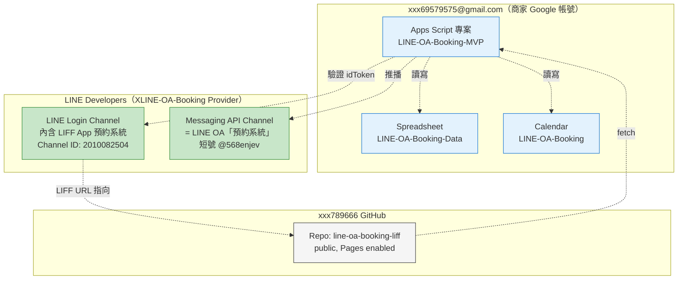

---

## 看圖的方法

- **VSCode**: 安裝 `Markdown Preview Mermaid Support` 擴充
- **GitHub**: 推上去後 `.md` 在 web UI 自動 render
- **Obsidian / Typora / Notion**: 原生支援
- **單純看**: 把 mermaid 區塊複製到 https://mermaid.live/ 線上渲染

---

> 本文檔對應 git tag `v0.1.0-mvp`、GAS deployment v15。任何流程有變更請同步更新本檔。
